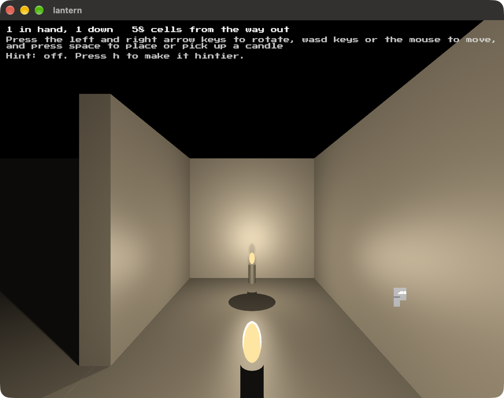

# lantern

A dark maze and two lamps to light it with. The game is deciding where to leave
them: ahead, where you cannot see, or behind, where you will otherwise get lost.



You have two candles. Set one down and it keeps burning where you left it. Braziers already
lit mark some areas and are not movable. Press h for a hint,
which adds clues from nothing to the whole way out, and m for a map of everywhere your
own light has fallen. Walk out through the door at the end you win!

Built on [blitzkit](https://github.com/jvalol/blitzkit), the seventh game on
that engine, and the first to use its point light shadows.

```
cargo run
```

---

I asked AI to draft this for me. I've edited it. Any surviving AI smells are my oversight.
